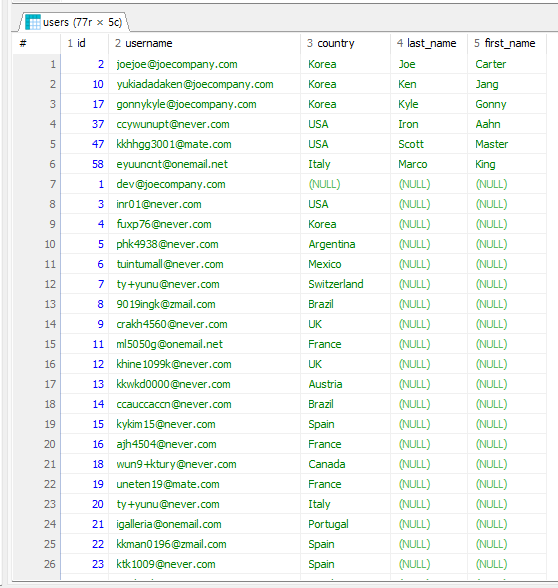
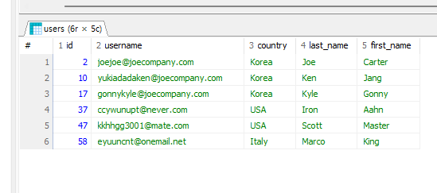
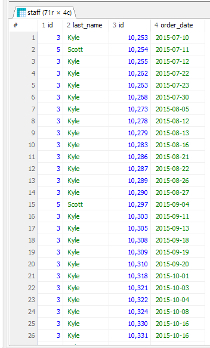
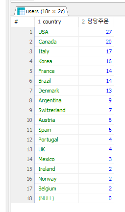
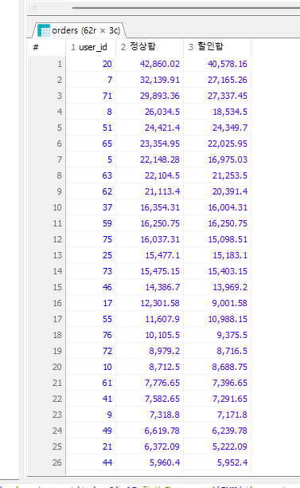

# 입실 체크 해주세요 !! 🎈

## CROSS JOIN
- 예제 문제 : users와 orders의 _모든 가능한 행 조합_ 을 만들어내는 쿼리를 작성하시오.

```sql
SELECT * FROM users u CROSS JOIN orders o;
```
- CROSS JOIN은 두 집합을 조합해 만들 수 있는 모든 경우의 수를 생성하는 `카테시안 곱(cartesian product)`을 출력한다. u.id와 o.user_id를 연결하는 등의 조건이 없이 두 테이블의 모든 행을 합쳐서 만들 수 있는 모든 경우의 수를 만드는 것에 해당함.
- 예를 들어 10행인 테이블과 20행인 테이블을 CROSS JOIN하면 결과 테이블은 10*20인 200행이 됩니다. 그리고 이외의 경우의 수는 존재하지 않습니다.
- 모든 경우의 수를 만들어내기 때문에 ON 조건을 설정할 필요가 없음.

## JOIN에 대한 전반적인 정리
- 두 테이블의 행을 서로 조합하는 과정인데, 여러 가지(LEFT, RIGHT, INNER, CROSS, FULL OUTER)가 존재하면서, ON 조건을 활용하여 전체 경우의 수에서 어떤 행만 가져올 수 있을지를 정할 수 있다.
- FULL OUTER JOIN의 경우 CROSS JOIN과 차이가 존재하는데, LEFT JOIN의 결과값과 RIGHT JOIN의 결과값을 _중복 없이_ 결합하는 개념으로, 합집합에 해당함. 전체를 구하는 컨셉을 유사하나 합집합이 전체 경우의 수를 의미하는 것은 아니기 때문에 구분해서 사용할 필요가 있습니다. CROSS JOIN과 달리 ON 조건을 요구합니다.

- 운영 환경에서는 CROSS JOIN을 제한하는 편입니다. 전체 경우의 수를 구하는데 실제로 필요한 경우는 거의 없기 때문입니다.

- FULL OUTER JOIN의 경우 DB에 따라 아예 지원하지 않는 경우도 있음.

### 연습문제
1. users와 staff를 참고하여 회원 중 직원인 사람의 회원 id, 이메일, 거주도시, 거주국가, 성, 이름을 출력하시오.


2. staff와 orders를 참고하여 직원 아이디가 3번, 5번인 직원의 담당 주문을 출력하시오. 단 직원id, 직원 성, 주문 아이디, 주문일자만 출력하시오.


3. users와 orders를 참고하여 회원 국가 별 주문 건수를 내림차순으로 출력하시오.


4. orders와 orderdetails, products를 참고하여 회원 아이디 별 주문 금액의 총합을 정상 가격과 할인 가격 기준으로 각각 구하시오. 단, 정상 가격 주문 금액의 총합 기준으로 내림차순 정렬할 것.

5. 이하의 조건에 해당하는 테이블이 있다고 가정했을 때 질문에 답하시오.
    - 왼쪽 테이블 A : 컬럼 개수 5 개 / 150 행
    - 오른쪽 테이블 B : 컬럼 개수 7개 / 100 행
    - 두 테이블은 공통 키 값 컬럼을 1 개 보유
  위 조건의 두 테이블을 CROSS/LEFT/RIGHT/INNER JOIN으로 결합했을 때 결과 테이블의 행과 열 개수를 계산하시오(SELECT * 기준) 

```sql
SELECT 
  u.id, 
  u.username, 
  u.country, 
  s.last_name, 
  s.first_name 
  FROM users u inner JOIN staff s 
  ON u.id = s.user_id;

SELECT s.id, s.last_name, o.id, o.order_date 
  FROM staff s LEFT JOIN orders o ON s.id = o.staff_id 
  WHERE s.id IN (3, 5);

SELECT u.country, COUNT(DISTINCT o.id) AS 담당주문 
  FROM users u LEFT JOIN orders o ON u.id = o.user_id 
  GROUP BY u.country 
  ORDER BY 담당주문 DESC;

SELECT 
  o.user_id, 
  round(SUM(price * quantity), 2) AS 정상합,
  round(SUM(discount_price * quantity), 2) AS 할인합 
  FROM orders o LEFT JOIN orderdetails od ON o.id = od.order_id 
  INNER JOIN products p ON od.product_id = p.id 
  GROUP BY o.user_id 
  ORDER BY 정상합 DESC;
```