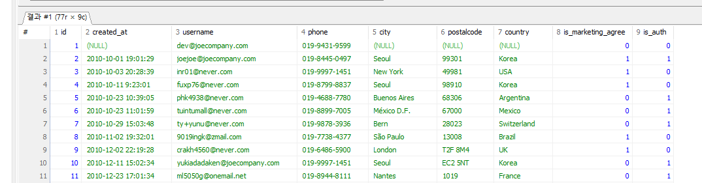

# 입실 체크 해주세요 !! 🎈

## CROSS JOIN
- 예제 문제 : users와 orders의 _모든 가능한 행 조합_ 을 만들어내는 쿼리를 작성하시오.

```sql
SELECT * FROM users u CROSS JOIN orders o;
```
- CROSS JOIN은 두 집합을 조합해 만들 수 있는 모든 경우의 수를 생성하는 `카테시안 곱(cartesian product)`을 출력한다. u.id와 o.user_id를 연결하는 등의 조건이 없이 두 테이블의 모든 행을 합쳐서 만들 수 있는 모든 경우의 수를 만드는 것에 해당함.
- 예를 들어 10행인 테이블과 20행인 테이블을 CROSS JOIN하면 결과 테이블은 10*20인 200행이 됩니다. 그리고 이외의 경우의 수는 존재하지 않습니다.
- 모든 경우의 수를 만들어내기 때문에 ON 조건을 설정할 필요가 없음.

## JOIN에 대한 전반적인 정리
- 두 테이블의 행을 서로 조합하는 과정인데, 여러 가지(LEFT, RIGHT, INNER, CROSS, FULL OUTER)가 존재하면서, ON 조건을 활용하여 전체 경우의 수에서 어떤 행만 가져올 수 있을지를 정할 수 있다.
- FULL OUTER JOIN의 경우 CROSS JOIN과 차이가 존재하는데, LEFT JOIN의 결과값과 RIGHT JOIN의 결과값을 _중복 없이_ 결합하는 개념으로, 합집합에 해당함. 전체를 구하는 컨셉을 유사하나 합집합이 전체 경우의 수를 의미하는 것은 아니기 때문에 구분해서 사용할 필요가 있습니다. CROSS JOIN과 달리 ON 조건을 요구합니다.

- 운영 환경에서는 CROSS JOIN을 제한하는 편입니다. 전체 경우의 수를 구하는데 실제로 필요한 경우는 거의 없기 때문입니다.

- FULL OUTER JOIN의 경우 DB에 따라 아예 지원하지 않는 경우도 있음.

### 연습문제
1. users와 staff를 참고하여 회원 중 직원인 사람의 회원 id, 이메일, 거주도시, 거주국가, 성, 이름을 출력하시오.


2. staff와 orders를 참고하여 직원 아이디가 3번, 5번인 직원의 담당 주문을 출력하시오. 단 직원id, 직원 성, 주문 아이디, 주문일자만 출력하시오.


3. users와 orders를 참고하여 회원 국가 별 주문 건수를 내림차순으로 출력하시오.


4. orders와 orderdetails, products를 참고하여 회원 아이디 별 주문 금액의 총합을 정상 가격과 할인 가격 기준으로 각각 구하시오. 단, 정상 가격 주문 금액의 총합 기준으로 내림차순 정렬할 것.

5. 이하의 조건에 해당하는 테이블이 있다고 가정했을 때 질문에 답하시오.
    - 왼쪽 테이블 A : 컬럼 개수 5 개 / 150 행
    - 오른쪽 테이블 B : 컬럼 개수 7개 / 100 행
    - 두 테이블은 공통 키 값 컬럼을 1 개 보유
  위 조건의 두 테이블을 CROSS/LEFT/RIGHT/INNER JOIN으로 결합했을 때 결과 테이블의 행과 열 개수를 계산하시오(SELECT * 기준) 

- CROSS JOIN
  - rows : 15000행(150*100)
  - columns : 12개

- LEFT JOIN
  - rows : 최소 150, 최대 15000행
  - columns : 12개

- RIGHT JOIN
  - rows : 최소 100, 최대 15000행
  - columns : 12개

- INNER JOIN
  - rows : 최소 0행, 최대 15000행
  - columns : 12개

- 이상의 답안은 SQLD 중심이라기 보다 실무에서 일어날 수 있는 수준이고 실제 시험 상황에서는 구구단 수준+@로 나올거기 때문에 실제 rows 계산 정도는 하게 될 수 있습니다.

```sql
SELECT 
  u.id, 
  u.username, 
  u.country, 
  s.last_name, 
  s.first_name 
  FROM users u inner JOIN staff s 
  ON u.id = s.user_id;

SELECT s.id, s.last_name, o.id, o.order_date 
  FROM staff s LEFT JOIN orders o ON s.id = o.staff_id 
  WHERE s.id IN (3, 5);

SELECT u.country, COUNT(DISTINCT o.id) AS 담당주문 
  FROM users u LEFT JOIN orders o ON u.id = o.user_id 
  GROUP BY u.country 
  ORDER BY 담당주문 DESC;

SELECT 
  o.user_id, 
  round(SUM(price * quantity), 2) AS 정상합,
  round(SUM(discount_price * quantity), 2) AS 할인합 
  FROM orders o LEFT JOIN orderdetails od ON o.id = od.order_id 
  INNER JOIN products p ON od.product_id = p.id 
  GROUP BY o.user_id 
  ORDER BY 정상합 DESC;
```

## UNION
- 컬럼 목록이 같은 데이터를 위아래 결합
- 컬럼의 형식과 개수가 같은 두 데이터 결과 집합을 하나로 결합하는 기능.
- JOIN은 ON이 요구된다는 점이 있지만 애초에 제약 조건이 있는 UNION의 경우는 제약 조건을 일치시킨다면 결합 자체는 가능함.

- 예제 문제 : users를 full scan한 결과 집합에서 각 행을 2 번씩 출력하기
```sql
(SELECT * FROM users) UNION (SELECT * FROM users);
```
이상의 쿼리를 생각했을 때 앞에서 배운 이론적인 부분과 합쳤을 때 77 * 2 의 결과값이 나와야 할 것으로 보입니다. 하지만


좌측 상단을 확인했을 때 `결과`로 표시되는 것으로 보아 users를 그대로 가지고 온 것이 아니라는 것을 알 수 있습니다. 이는 중복제거가 적용된 결과값에 해당합니다.

- 중복 제거를 하지 않는 방식으로 적용하는 방법 : `UNION ALL`
```sql
(
	SELECT * 
		FROM users
) 
UNION ALL
(
	SELECT * 
		FROM users
)
ORDER BY id;
```
- UNION 및 ALL을 적용했을 때 SELECT문을 쓸 때 full scan한다면 상관없지만 특정 컬럼만 보여주겠다고 한다면 첫 번째 테이블에서 컬럼을 편집한 것과 동일하게 두 번 째 테이블도 수정해야 합니다.

```sql
(SELECT id, phone, country, city FROM users)
UNION ALL
(SELECT id, phone, country, city FROM users)
ORDER BY id;
```

그래서 지사에서 올라온 각 테이블의 row들을 통합할 때 본사에서 UNION을 쓸 수는 있겠네요.
실무적으로 UNION보다는 UNION ALL을 더 권장합니다. 대량의 데이터에서 중복 항목을 제거할 때 부하가 일어날 수 있기 때문에 일단 중복되더라도 보여주는 것을 좀 더 선호하고, 그 후에 조건절 등을 통해 분류합니다.

- 문제 : users에서 거주 국가가 Korea인 회원 정보만 추출하고, Mexico인 회원 정보만 추출하여 _결합 하시오._ 단, 회원아이디, 연락처, 거주도시, 거주국가만 출력하고, 거주국가 기준 알파벳 오름차순으로 작성하시오.

```sql
SELECT id, phone, city, country FROM users WHERE country = 'Korea' UNION ALL SELECT id, phone, city, country FROM users WHERE country = 'Mexico' ORDER BY country;
```

### 연습문제
1. orders에서 주문일자가 2015년 10월인 건과 2015년 12월인 건을 SELECT로 각각 추출하고 UNION ALL을 사용해 하나로 결합하시오. 단, 최종 결과는 최신 순으로 정렬하시오.

2. users에서 미국에 거주 중이면서 마케팅 수신에 동의한 회원 정보와 프랑스에 거주 중이면서 마케팅 수신 동의 하지 않은 회원 정보를 SELECT로 각각 추출하고, 두 결과 집합을 UNION ALL을 사용해 하나로 결합하시오. 단 최종 결과는 id, 연락처, 거주 국가, 거주 도시, 마케팅 수신 동의 여부 컬럼만 추출하고, 거주 국가 기준 알파벳 순 정렬하시오. 컬럼명 한국어로 다 바꾸시오.

3. UNION을 활용하여 주문 상세 정보 테이블 orderdetails와 제품 정보 테이블 products를 FULL OUTER JOIN 조건으로 결합하여 출력하시오.