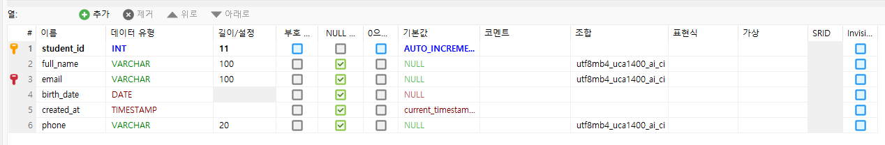

# 입실 체크 해주세요 !! 🎈

# 커리큘럼 50% 시점 : 3월 2일
1. 2월 19일 : SQL 과목 두 개
2. 2월 24일 : 스프링 부트 관련 두 개 과목(시험 변동 예정 - 뒤로)

# DDL
## CREATE : 테이블 생성
- 테이블을 만들 때는 각 컬럼의 데이터 타입과 제약조건을 설정할 필요있음
```sql
-- 1. CREATE : 테이블 생성
CREATE TABLE students (
	student_id INT AUTO_INCREMENT primary KEY,
	full_name VARCHAR(50) NOT NULL,
	email VARCHAR(100) UNIQUE,
	birth_date DATE,
	created_at TIMESTAMP DEFAULT CURRENT_TIMESTAMP
);
```
## ALTER : 테이블 수정
- 이미 만들어진 테이블에 새로운 컬럼을 추가하거나 타입을 변경할 때 사용

```sql
-- 컬럼 추가할 때
ALTER TABLE students ADD phone VARCHAR(20);

-- 컬럼 데이터 타입 수정
ALTER TABLE students MODIFY COLUMN full_name VARCHAR(100); 
```

## DROP : 테이블 삭제
테이블 자체를 완전히 삭제(복구가 어렵기 때문에 주의해야 합니다).
```sql
-- 테이블 삭제
DROP TABLE students;
```

# DML(Data Manipulation Language)
- 데이터를 직접 조작하는 create(INSERT), read(SELECT), update(UPDATE), delete(DELETE) 단계

## INSERT : 데이터 추가
데이터를 삽입할 때는 컬럼 순서와 데이터 타입을 일치시켜야 함.
```sql
-- INSERT
-- row 하나만 삽입한 예시
INSERT INTO students (full_name, email, birth_date)
  VALUES ('김일', 'kim1@test.com', '2026-02-12');
-- 여러 row 한 번에 삽입
INSERT INTO students (full_name, email)
	VALUES ('김이', 'kim2@test.com'),
			('김삼', 'kim3@test.com');	
```

## UPDATE : 데이터 수정
* 참조 사항 : `WHERE`절 생략시 테이블의 모든 행이 수정됩니다.
```sql
-- UPDATE
UPDATE students SET birth_date = '1990-01-01'
 	WHERE student_id = 2;

UPDATE students SET phone = '010-7445-7113'
	WHERE student_id = 3;
```

## DELETE : 데이터 삭제
* 참조 사항 : 마찬가지로 `WHERE`을 이용해 특정 row만 삭제해야 합니다. 고유값(PK)의 의미가 중요한 이유입니다.

```sql
DELETE FROM students WHERE student_id = 4;
```



# 통합 과제
1. 이하의 테이블들을 생성하시오.
    - courses
        - course_id : 자동증가 적용 / pk 적용 / int
        - course_name : 문자열(100) not null 적용
        - professor : 문자열(50)
        - credits : int default 3
    
    - enrollments
        - enrollments_id : 자동증가 적용 / pk 적용 / int
        - student_id : int / fk 적용
        - course_id : int / fk 적용
        - enroll_date : DATE

2. 더미 데이터 삽입
    - courses 테이블에 
        - 데이터베이스기초 / 강교수 / 3
        - 자바프로그래밍 / 이교수 / 4
        - 웹디자인 / 박교수 / 2

    - enrollments의 student_id / course_id / enroll_date에
        - 1, 1, '2026-02-01'
        - 1, 2, '2026-02-01'
        - 2, 1, '2026-02-02'

1. Create (데이터 추가)
문제 1.1: 새로운 학생 '박지민'(park@test.com, 1995-05-05, 010-5555-6666)을 students 테이블에 추가하세요.

문제 1.2: 새로운 과목 '파이썬 프로그래밍'(최교수, 3학점)을 courses 테이블에 추가하세요.

문제 1.3: 방금 추가한 '박지민' 학생이 '파이썬 프로그래밍'과 '데이터베이스기초' 과목을 오늘 날짜로 수강 신청하게 하세요.

주의: SELECT 문으로 먼저 학생과 과목의 ID 번호를 확인한 뒤 INSERT 하세요.

2. Read (데이터 조회)
문제 2.1: '이교수'가 담당하는 모든 과목의 이름을 출력하세요.

문제 2.2: 이메일 주소에 'test.com'이 포함된 학생들의 이름과 전화번호를 조회하세요.

문제 2.3 [JOIN]: 현재 '데이터베이스기초' 과목을 듣고 있는 학생들의 이름과 그들의 수강 신청 날짜를 출력하세요.

3. Update (데이터 수정)
문제 3.1: kim2 학생의 전화번호가 010-1597-7533으로 변경되었습니다. 정보를 수정하세요.

문제 3.2: '웹디자인' 과목의 담당 교수가 '박교수'에서 '김교수'로 변경되었습니다. 과목 정보를 업데이트하세요.

문제 3.3: 모든 과목의 학점(credits)을 1학점씩 상향 조정하세요.

4. Delete (데이터 삭제)
문제 4.1: kim2 학생이 자퇴를 결정했습니다. students 테이블에서 해당 학생을 삭제하세요.

돌발 상황: 만약 삭제 시 외래키 에러가 발생한다면, 왜 발생하는지 설명하고 enrollments 테이블의 데이터를 먼저 삭제한 뒤 다시 시도해 보세요.

문제 4.2: 수강 인원이 0명인 과목을 찾아 courses 테이블에서 삭제하세요.